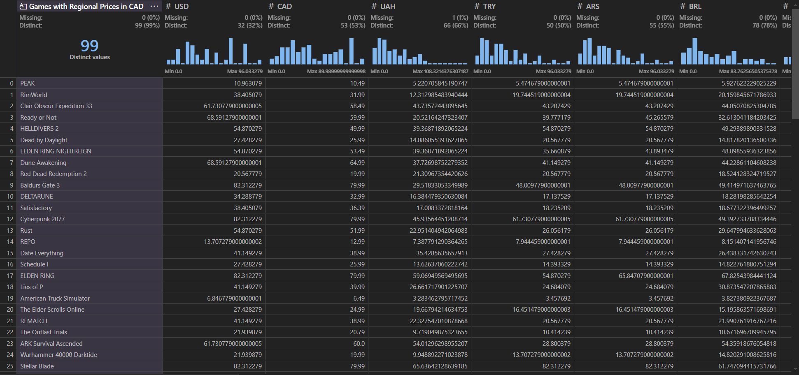

# Steam Region Comparison Web Crawler

## Description
This is a program I developed to explore web crawling, accessing data via APIs, and exporting data as a spreadsheet.

The program searches steam for a list of games and compares their prices across different regions. The result is exported to a .csv.

Example with prices in CAD (Opening the CSV in Microsoft Data Wrangler):

## Using
Run `python main.py <CurrencyToDisplay> <MaximumNumberOfGamesToSearch> <ExchangeRate-APIKey?>` in the program's directory

## Prerequisites
* Python 3.x
* beautifulsoup4
* python-dotenv

* An [ExchangeRate-API](https://app.exchangerate-api.com/) key either stored in a .env file:

    `EXCHANGE_RATE_API_KEY = <ExchangeRate-APIKey>`
    
    OR specified directly when running the program
